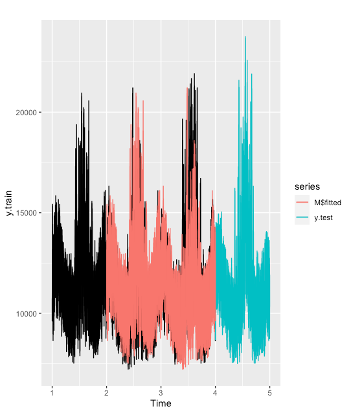

## Executive Summary

In this project, we are going to forecast the hourly load using time series based on the historical load from 1/1/2008 – 12/31/2012. Not only I used various models from class including Decomposition – Arima, Decomposition – Ets, Neural network (nnetar), smoothing model Ets, Naïve model, seasonal naïve model, Auto Arima and linear regression model, but also tried methods in the “Cases with Codes for SCE project” which includes random forest, GBM, AutoML and XGBoost (1)(3). The best model is XGBoost which has a MAPE of 2.96% on testing data (year 2012).

## Introduction

##### Data cleaning

##### EDA

Despite ggplot we learned in class, I also tried the way learned in the Kaggle competition mentioned at the beginning. The graphs are more compact. Results are shown below

Based on the graph, I observe strong daily, weekly and yearly seasonality.

##### Feature engineering

In this step, I did some feature engineering for linear regression and machine learning model.

## Methodology

After dealing with the data, next step is to choose a champion model based on their MAPE. More specifically, I split the data into training and testing data. Since we don’t have the data for year 2012. I will train on the years before 2011 and test on year 2011. Then I will compare their MAPEs on the testing data.

##### Create time series object

Since the data has daily, weekly and yearly seasonality, I create multi-seasonal time series:

##### Split train and test

Training: 1/1/08 - 12/31/2010

Testing: 1/1/2011- 12/31/2011

Using the window function:

Split the data for regression and machine learning model:

## Model Compare

##### Model used and graph:

##### Mstl – Arima:

##### Mstl – ets:

Both mstl-arima and mstl-ets models have pretty result as they are able to catches multiple seasonalities in our data. The best MAPE is 8.92 on testing set (year 2011).

##### Nnetar:

##### Ets model:

Both nnetar and ets model fit well on the training data as they achieve a MAPE below 2. However, they gave a nearly straight line for testing data.

##### Naïve and Seasonal naïve model:

##### Auto Arima:

For auto arima model, I first build without changing the default p,d,q,P,D,Q value. As the graph shown below, it gave a straight line. Therefore, I used a loop to change p,d,q,P,D,Q value.

The first loop is to decide the combination of the non-seasonal part, while second loop is to decide the numbers for the seasonal part.

##### Linear regression model:

By adding daily, weekly and yearly lags to the model, the performance improved and receive a MAPE of 6.4938 on testing data.

Inspired by Tao Hong’s paper mentioned in Q&A (2), I added features like Hour*T^2, Hour*T^3, Month*T^2, Month*T^3, Day*Hour. These features help to boost my MAPE to 5.7633.

##### Machine learning models:

Following methods are learned from the article from the Kaggle competition (1). These machine learning models have a lower MAPEs.

##### Random Forest:

##### GBM:

##### AutoML:

This model can run through several models and record the summary on its “leaderboard”. By calling the “leader” from the “leaderboard”, we can get the best model which is XGBoost.

As in the graph below, AutoML shows that the best model is xgboost with 536 trees. Its MAPE is 3.3 and RMSE is 146.11.

##### Xgboost:

In the xgboost model, I added the useful features created previously for regression. The lowest MAPE it got is 3.4 on test set.

##### NN in Python:

I also tried NN in python. The codes are learned in a tutorial(5).

##### Xgboost in Python:

## Model Selection

Based on the chart above and the analysis, the champion model is Xgboost.

## Results/analysis

I used the champion model which is Xgboost to predict the hourly demand in 2012. In this step, I split the data before 2012 to the training data and after 2012 to be test data.

In order to improve the performance of my Xgboost model, I tried different features. Inspired by Tao Hong’s paper, I record the features using in each xgboost model and their testing MAPE on 2012 data.

I also tried Xgboost in python learned from the link in Q&A.(3)

Based on the features tried in R, I got a MAPE of 4.07 in python by using Xgboost. In order to further improve my model. I did more research on how to predict energy. After read some articles, I thought adding “holidays” might be useful. Also, temperature can be a factor effecting the power using. Therefore, I added lags, mean, std, max and min on the temperature. The coding part is learned in a Kaggle artivle.(4) Finally, I receive a MAPE of 2.96%.

&nbsp;

--------------------------------------
Reference

(1) [https://www.kaggle.com/goldens/hourly-energy-consumption-time-series-analysis](https://www.kaggle.com/goldens/hourly-energy-consumption-time-series-analysis)

(2) [https://repository.lib.ncsu.edu/bitstream/handle/1840.16/6457/etd.pdf?sequence=2&isAllowed=y](https://repository.lib.ncsu.edu/bitstream/handle/1840.16/6457/etd.pdf?sequence=2&isAllowed=y)

(3) [https://www.kaggle.com/robikscube/tutorial-time-series-forecasting-with-xgboost/notebook](https://www.kaggle.com/robikscube/tutorial-time-series-forecasting-with-xgboost/notebook)

(4) [https://www.kaggle.com/sayedathar11/time-series-forecasting-xgboost-lags-and-rolling](https://www.kaggle.com/sayedathar11/time-series-forecasting-xgboost-lags-and-rolling)

(5) [https://www.tensorflow.org/tutorials/keras/regression](https://www.tensorflow.org/tutorials/keras/regression)
